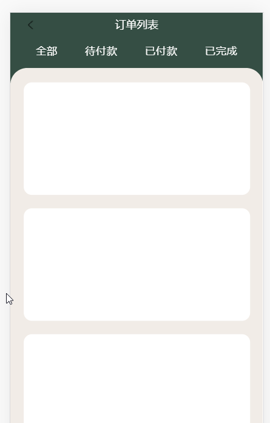

# 2020-02-5 疑问

1. Vue 中 slot 的渲染问题

   ```javascript
   <template>
     <div class="scroll-wrapper" ref="baseScroll">
       <div class="scroll-content">
         <slot name="content"></slot>
       </div>
     </div>
   </template>
   ```

   如上代码,在引用组件时,给 scroll-content 设置样式无效!在`.scroll-content`里的 class 生效

2. **call,apply,bind 什么作用?**

3. Vue 中动态路由下的子路由怎么设置 to 属性?

4. 一个容器设置 `overflow:hidden`  属性的状态下(里面的内容可以滚动),给其添加`padding-top:x`  属性,那么容器里滚动的内容将会在何处开始隐藏?(Better-scroll)

5. 什么是路由?

6. Vue 中父子组件通信的方式?

7. Vue 中的路由如何返回上一级？

8. `display：flex` 布局，加上`flex-wrap:wrap` 属性，为什么会使同一行的元素高度相同

9. **随机数公式？**

10. `v-for`属性循环的标签怎么实现,不同的标签应用不同的样式(class 类名)?

11. `Vue`中 class 绑定多个类名?

12. `import { swiper, swiperSlide } from "vue-awesome-swiper";` 此种方式引入`Swiper` swiper-slides 偶尔会想 li 列表一样排列,不知道为什么?

13. swiper 配置如下效果

    

    只需设置`slidesPerView: "auto",`和`centeredSlides: true`,再给`swiper-slide`自定义宽度即可实现

14. vue 中能不能给组件设置点击事件(swiper-slide 设置点击事件无效,'曲线救国')

15. Better-scroll 中好像不用初始化也可以用?

16. 如下如所示,这种情况是用 Tab 页好点还是用路由做?

    

17. 什么事跨域?如何解决跨域问题?

18. vue-admin-element 框架中如何代理请求和封装 api?

19. vue-admin-element 中对`axios`的封装理解?

20. vue-element-ui 中的 select 选择列表中的数据是怎么绑定的?

21. axios 的封装?

22. `.sync`修饰符

23. 已知有以数组,每一个数组项都是对象(对象内嵌套对象),现想取出每一个数组项中的对象的对象的某个属性值最为新的数组?

24. 有一数组 `let arr = ["nihao", "hello", "world"];` 将其转换为`'xx','xx','xx'`的字符串?

    ```javascript
    let arr = ["nihao", "hello", "world"];
    let newArr = "";
    for (let i = 0; i < arr.length; i++) {
      if (i === arr.length - 1) {
        newArr += "'" + arr[i] + "'";
      } else {
        newArr += "'" + arr[i] + "'" + ",";
      }
    }
    console.log(newArr);
    ```

25. Vue 中`v-for` 对象循环时具体知识点

26. Vue-router 编程式导航写法？

27. JS 中,一个对象内 `收货人: this.orderUserInfo.NAME,` 与 `'收货人': this.orderUserInfo.NAME,` 两种写法有区别么?

28. `eval()` 转换成 `window.Function()`的方式?

29. `box-sizing:border-box` 相邻父元素的子元素添加外边距(此时父元素添加内边距)

30. vue 保持登录逻辑?

31. v-for 指定循环的标签不同的类名方法?

32. vue 中计算属性传值(闭包,闭包内 this.xx 依此更新依赖),

33. JS 中函数传参(Number 类型),怎么才能取到以 0 开头的十进制的数字?

34. git 怎么创建'没有关联的两个分支',就像 hexo 博客备份那样?

35. vue 中 data 中,属性对应的属性值不可以使用计算属性么?

36. vue 的双向绑定原理

37. vue 的 nexttick 原理、diff 算法

38. 如何封装一个自己的 promise?(了解其原理)

39. eventloop 事件循环
40. 怎么防止快速点击提交按钮造成多次请求?
41. vue-element-admin 中axios的封装?(包括使用以及提示用户信息等)


