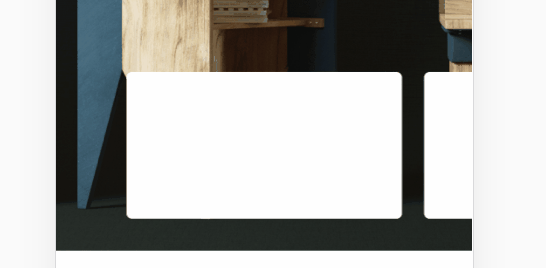

# 2020-02-5 疑问

1. Vue 中 slot 的渲染问题

   ```javascript
   <template>
     <div class="scroll-wrapper" ref="baseScroll">
       <div class="scroll-content">
         <slot name="content"></slot>
       </div>
     </div>
   </template>
   ```

   如上代码,在引用组件时,给 scroll-content 设置样式无效!在`.scroll-content`里的 class 生效

2. call,apply,bind 什么作用?

3. Vue 中动态路由下的子路由怎么设置 to 属性?

4. 一个容器设置 `overflow:hidden`  属性的状态下(里面的内容可以滚动),给其添加`padding-top:x`  属性,那么容器里滚动的内容将会在何处开始隐藏?(Better-scroll)

5. **什么是路由?**

6. Vue 中父子组件通信的方式?

7. Vue 中的路由如何返回上一级？

8. `display：flex` 布局，加上`flex-wrap:wrap` 属性，为什么会使同一行的元素高度相同

9. 随机数公式？

10. `v-for`属性循环的标签怎么实现,不同的标签应用不同的样式(class 类名)?

11. `Vue`中 class 绑定多个类名?

12. `import { swiper, swiperSlide } from "vue-awesome-swiper";` 此种方式引入`Swiper` swiper-slides 偶尔会想 li 列表一样排列,不知道为什么?

13. swiper 配置如下效果

    

    只需设置`slidesPerView: "auto",`和`centeredSlides: true`,再给`swiper-slide`自定义宽度即可实现

14. vue 中能不能给组件设置点击事件(swiper-slide 设置点击事件无效,'曲线救国')

15. Better-scroll 中好像不用初始化也可以用?

16. 如下如所示,这种情况是用 Tab 页好点还是用路由做?

    

17.
