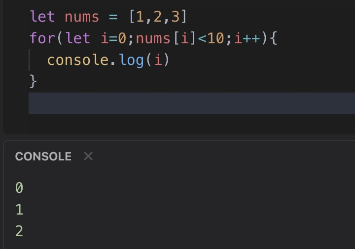

# 2020-03-05 疑问

1. Array 的 map 方法?

2. props 数据在什么阶段可以完全使用?

3. 当 i 等于 3 的时候,nums[i]为 undefined,undefined 与任何值比较返回 false,所以跳出循环,不存在越界
   

4. 什么时 UJS?

5. 前端持续集成?

6. vuex 模块化 `namespaced: true` ?

7. vuex 中 getters 想传参的话可已返回一个函数,具体需求在哪?

8. veux 中 getter 用在哪,例:比如有一个对象数组(学生),在多个页面中都需要显示年龄大于 20 岁的,此时用 getters,再继续,现在需要显示年
   龄大于指定岁数的需求,此时,getters 需要一个返回函数的属性.

9. vue-element-admin 动态菜单怎么设置?

10. 11. 检查接口 请求地址 请求方式 字段

11. flex 横向滚动(隐藏滚动条)

12. vue 中标签内`

` `:test` 是属性 ,第二个`test2`是什么,很多组件设置都是这样的?

13. SHA1 加密,登陆的时候如何防止不法人员拦截数据获取明文信息,以及密码非明文存储,是怎么验证输入的密码的?

14. axios 上传文件时需要提交一个 Formdata 类型的对象,扩展:content-type 共有多少中方式,各用在什么情况下,以及 request 该如何去封装,还有 qs 模块的使用?

15. 为什么 `v-if` 和 `v-for` 不能同时在一个标签内使用?

16. vue 中数据哪些方法不是响应式的?

17. `Symbol` 类型有什么特点和注意点

18. `this`的执行,构造函数,对象等情况

19. ES6 的 class 类概念?

20. JS 中原型链和闭包?

21. uniapp 中 css 样式背景图片,再微信小程序等平台不显示?

22. 透明三角形?

23. `Data`对象的使用？

24. 字符串与数字相加减？

25. js 异步加载的有多少中方式？

26. 判断一个对象在数组中出现的次数？

27. js 垃圾回收机制？

28. 关于 get 请求传参过长？
